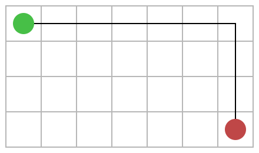
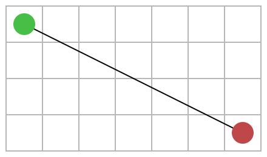

# Perspetiva de Implementação
 
## Caminho mais curto entre dois vértices
 
Em cada uma das fases de análise anteriormente deliberadas pode-se, seguramente, realçar como problema comum a determinação do caminho mais curto entre dois vértices numa rede viária. Em particular, enquadra-se perfeitamente nesta problemática a necessidade de, aquando da realização de um pedido, determinar o percurso que permite proceder à sua entrega, recorrendo ao trajeto de menor distância. Isto implicará:
- determinar o percurso transitável mais curto, que permita a cada um dos estafetas alcançar um ou mais restaurantes dos quais o pedido foi solicitado;
- calcular, no caso de pedidos realizados num só restaurante, o trajeto de menor distância entre o restaurante e o ponto de entrega especificado pelo cliente.
 
Assim, é pertinente analisar a variedade de algoritmos e alternativas de implementação disponíveis para o cálculo do caminho mais curto entre dois vértices. Só a realização desta análise prévia tornará possível perceber o impacto das vantagens e desvantagens de cada algoritmo e das suas variantes, no contexto da temática a ser trabalhada.
Salienta-se, portanto, que nenhum algoritmo a ser considerado na fase de implementação deve ser, ainda numa fase experimental, tomado como solução ideal, pois a sua aplicabilidade está dependente da dimensão e tipologia dos grafos de entrada e de uma análise cuidada da sua eficiência temporal e espacial, para cada caso.

Destaca-se ainda que, numa terceira fase, os resultados obtidos através da implementação dos algoritmos a ser analisados vão ser conciliados com as múltiplas restrições impostas pela temática. Pretende-se que, no processo de escolha de um estafeta para a realização de um pedido, a distância mínima que este precisa de percorrer para entregar o pedido em questão não seja o único fator determinante na sua escolha em detrimento da escolha de outro estafeta. Assim, o estafeta cuja distância seja a mínima obtida para a concretização de uma encomenda, não será obrigatoriamente selecionado para o realizar, sendo, também, fatores relevantes para a escolha do estafeta a capacidade que este pode transportar e o tipo de veículo por ele utilizado.
 
###  Algoritmos considerados
 
#### Dijkstra Unidirecional
 
A primeira alternativa de solução que pretendemos testar, no que diz respeito à eficiência temporal e aplicabilidade, no contexto do problema, passa essencialmente pela implementação de uma das múltiplas variantes do algoritmo de Dijkstra.
Este algoritmo ganancioso poderá ser vantajoso, na medida em que procura, a cada iteração, obter o melhor resultado possível, minimizando a distância percorrida. Para além disso, é logicamente aplicável ao grafo que será utilizado como dado de entrada, já que este se trata de um grafo dirigido - cada aresta representa uma via unidirecional; e pesado - o peso de uma aresta representa uma distância.
A variante a implementar permite, recorrendo a uma fila de prioridades (heap com mínimo à cabeça) como estrutura auxiliar, obter a distância mínima desde o vértice de origem até todos os outros vértices do grafo, garantindo-se um tempo de execução de $O((|V|+|E|) \times log |V|)$. Este tempo resulta das $|V|$ operações executadas na fila de prioridade (inserções/extrações), realizadas, cada uma, em tempo logarítmico, e da utilização da operação "Decrease-Key", realizada, no máximo, uma vez por aresta, com um tempo também logarítmico, para a fila de $|V|$ elementos.
Note-se que, nas fases previamente definidas, há a necessidade de aplicar o algoritmo mais do que uma vez:
- considerando como vértice de origem a posição atual de cada um dos estafetas disponíveis para efetuar a entrega de um pedido;
- assumindo que o vértice de origem é o restaurante do qual foi solicitado o pedido.
 
No entanto, o que se pretende realmente é utilizar o algoritmo de Dijkstra como base para encontrar o caminho mais curto entre dois pontos, pelo que se vai descobrir o caminho mais curto do vértice de origem para todos os outros, terminando o algoritmo quando se for processar o vértice que procuramos, uma otimização que evita continuar a processar vértices, quando já se descobriu o caminho pretendido.
Assim, como, nas duas primeiras fases de implementação, a escolha do estafeta a realizar o pedido depende exclusivamente da sua proximidade ao restaurante do qual este foi solicitado, é necessário determinar, em primeiro lugar, o caminho mais curto para cada um dos estafetas se deslocar até aos respetivos estabelecimentos, sendo, em cada situação, o vértice de destino o restaurante. De seguida, aplica-se, novamente, o algoritmo, para encontrar o percurso mais curto do restaurante à morada escolhida para o ato de entrega, usando o vértice de destino correspondente à localização indicada pelo cliente.
 
Espera-se, ao aplicar este algoritmo, em alguns casos específicos, entre os quais, mapas de estradas com poucos vértices e distâncias curtas, obter tempos de execução razoáveis. No entanto, para trajetos longos e mapas de estradas complexos, a utilização do algoritmo de Dijkstra, na sua variante unidirecional, gerará, certamente, tempos de execução demasiado longos, o que nos levará, provavelmente, a experimentar otimizações e outros algoritmos que permitam obter, com maior eficácia temporal, o caminho mais curto para a entrega de um pedido.
 
#### Dijkstra Bidirecional
 
Uma das otimizações que se procura explorar com mais detalhe na fase de implementação, para o algoritmo de Dijkstra, tendo em conta que o resultado esperado para a variante unidirecional não é o desejado, é a variante bidirecional. A execução alternada do algoritmo de Dijkstra, no sentido do vértice de origem para o de destino, e no sentido inverso, poderá trazer vantagens no que diz respeito ao tempo de execução, esperando-se que este seja reduzido para metade, em comparação com a variante do algoritmo que utiliza pesquisa unidirecional.
Esta melhoria deriva do facto de a área processada diminuir para metade, já que a pesquisa passa a ser executada nas duas direções, mantendo-se sempre a distância mais curta descoberta até ao momento e verificando-se, ao processar uma aresta já processada previamente, na direção oposta, se foi descoberta uma distância menor.
Deste modo, a variante bidirecional do algoritmo de Dijkstra vai ser aplicada com o intuito de melhorar o tempo de cálculo do percurso mais curto entre o estafeta e o restaurante e, posteriormente, entre o restaurante e o local de entrega, no caso de pedidos que envolvam um só restaurante.
 
#### Algoritmo A*
 
O algoritmo A* será, também, objeto de estudo, na fase de implementação, não só por ser mais um algoritmo que permite, igualmente, calcular o caminho mais curto entre dois vértices, mas, essencialmente, pela sua performance se diferenciar do algoritmo de Dijkstra, pelo facto de recorrer a heurísticas para manipular os pesos das arestas e, assim, afetar os nós que são expandidos.
Antes de mais, é essencial escolher, cuidadosamente, a heurística a utilizar, porque esta desempenhará um papel determinante no comportamento do algoritmo e nos resultados obtidos.

Posto isto, tendo em conta as propriedades dos vértices dos grafos a tratar, foram consideradas três funções de heurística diferentes que farão parte do processo de implementação e análise deste algoritmo em concreto. Todas elas atuarão em função das coordenadas dos pontos no mapa e darão, sempre, um valor aproximado menor que o custo real do percurso, entre os vértices escolhidos.

A primeira estratégia tem o nome de **Manhattan Distance** e calcula a distância, como número de quadrados percorridos, em ambas as direções, desde o ponto inicial, até ao final. Tem particular interesse em mapas com a forma de grelha e usa, para o efeito, a seguinte fórmula generalizada:

$h=∣x_{start}​−x_{destination}​∣+∣y_{start}​−y_{destination}​∣$

Outra estratégia, conhecida como **Euclidean Distance**, um pouco mais precisa que a anterior, explora o percurso em linha reta, demorando, em contrapartida, mais tempo a executar, por necessitar de explorar uma área maior. A sua função é representada na forma:

$h=\sqrt{(x_{start}​−x_{destination}​)^2+(y_{start}​−y_{destination}​)^2}$ 

Por fim, existe também a **Diagonal Distance**. Esta última perde interesse real, quando comparada com as outras funções, porque tem a limitação de só poder ser usada em movimentos realizados numa direção apenas:

$h = \max( abs(x_{start} – x_{destination}), abs(y_{start} – y_{destination}) )$

Este algoritmo em particular é conhecido por não garantir uma solução ótima em muitos casos. No entanto, os seus resultados serão avaliados, a par com os restantes algoritmos, tendo em conta, também, as diferentes funções de heurística aqui referidas. 

> Ver, para fontes das heurísticas referidas:
> https://brilliant.org/wiki/a-star-search/#heuristics
> http://theory.stanford.edu/~amitp/GameProgramming/Heuristics.html
> https://www.redblobgames.com/pathfinding/a-star/implementation.html
> https://medium.com/@nicholas.w.swift/easy-a-star-pathfinding-7e6689c7f7b2
> https://www.growingwiththeweb.com/2012/06/a-pathfinding-algorithm.html
> https://www.geeksforgeeks.org/a-search-algorithm/
> As mais usadas são Manhattan Distance, Euclidean Distance, ou até a Diagonal Distance , mas esta última é limitada

#### Algoritmo Floyd-Warshall

O último algoritmo analizado será o de Floyd-Warshall. Este é mais um algoritmo que nos permite calcular o caminho mais curto entre 2 pontos num grafo e baseia-se numa matriz de distâncias pré-processada inicialmente, onde se encontra a menor distância entre cada par de vértices do grafo. 
A complexidade temporal deste algoritmo é O(V3).
(... completar)

#### Abordagem ao "Travelling Salesman Problem"

Na terceira fase, o caso em que se consideram múltiplos restaurantes no mesmo pedido, poderá ser visto como uma generalização do típico "Travelling Salesman Problem", pois o objetivo é encontrar o menor caminho possível para que cada estafeta visite todos os restaurantes associados a um pedido apenas uma vez. É de notar, no entanto, que o problema original considera que após visitados todos os pontos de interesse é necessário regressar ao ponto de origem, o que não será o caso, pois pretende-se que o destino seja a morada do cliente.
Acrescenta-se, assim, a restrição de exisitir um ponto de origem e de destino predeterminados, respetivamente a posição inicial do estafeta e a morada de entrega do pedido.

Tendo em conta a dificuldade de conseguir uma soluçã ótima para este problema, vamos procurar abordá-lo recorrendo a diferentes estratégias, escolhendo a que apresentar o comportamento mais próximo do esperado para cada caso.

A alternativa mais direta seria aplicar um algoritmo "brute-force" que testasse todas os percursos possíveis, preservando, a cada iteração, aquele caminho que apresentasse uma distância mais curta. No entanto, esta solução é impraticável pelo seu elevado tempo de execução, Θ(n!), até para grafos pouco densos.

Também são conhecidas alternativas de solução para o problema recorrendo a algortimos de programação dinâmica que, apesar de apresentarem melhorias em comparação com a solução "brute-force", ainda apresentam um tempo exponencial O(2^n * n^2), apresentando, para além disso, complexidade espacial elevada, O(2^n * n), o que nos leva a descartá-lo para o efeito desejado.

A alternativa, que, à partida, nos parece a mais viável tendo em conta os conhecimentos adquiridos até agora, baseia-se numa abordagem gananciosa, já que procura, em cada iteração, escolher a solução ótima, ou seja, neste caso, escolher o restaurante mais perto do anterior.
Assim, tendo como vértice de origem a posição de cada estafeta, procuraria-se construir o percurso até à morada de entrega do pedido, escolhendo, a cada iteração, o restaurante de menor distância.
Para esta abordagem gananciosa será, no entanto, necessário ter calculado previamente as distâncias entres os vários pontos do grafo. Para isso, pensamos recorrer ao algoritmo de programação dinâmica Floyd Warshall, referido anteriormente, obtendo, assim, o caminho mais curto entre
todos os pares de vértices, a usar posteriormente para determinar o caminho de cada estafeta para alcançar todos os restaurantes e, por fim, a morada do cliente.

Uma abordagem semelhante mas no sentido inverso poderá ser realizada no caso de os estafetas utilizarem o mesmo meio de transporte, isto é, quando se conhece previamente o grafo de entrada. Nestes casos, ao escolher um estafeta para realizar um pedido, pode tomar-se como ponto de partida a morada de entrega do pedido e, no grafo invertido, construir o percurso a realizar com base na estratégia referida anteriormente: escolhendo, neste caso, o restaurante mais perto da morada do cliente numa primeira iteração e, posterioremente, optando sempre pelo restaurante mais próximo do anterior. Por fim, inclui-se no percurso a localização do estafeta.