# 5. Implementação

Iniciada a parte de implementação prática de tudo o que foi discutido anteriormente, os dados de partida, mapas e código genérico foram recolhidos e as novas classes foram criadas, de acordo com tudo o que foi estabelecido como dados de entrada. É de notar que as soluções, disponibilizadas em código nas aulas práticas, para os grafos, vértices e arestas e respetivos algoritmos foram adaptadas e reorganizadas, para melhor satisfazerem as nossas necessidades.

## 5.1 Estruturas de dados 

Para representar toda a informação necessária e construir a aplicação final, em conformidade com o que foi especificado, dividimos a implementação nas classes relativas. São elas:
* Classe **Graph**, presente no ficheiro *Graph.h* para representar o Grafo.
* Classes **Edge** e **Vertex**, para representar os constituintes do grafo, respetivamente as arestas e os vértices.
* Classe **Coordinates**, usada como implementação da classe *Template T* das estruturas anteriores, representando as coordenadas dos vértices que servem de identificação e são usadas para o cálculo das distâncias reais e visualização dos mapas.
* Classe **Employee**, que representa um Estafeta, com todos os atributos anteriormente descritos.
* Classe **Request**, concretizando e contendo a informação de um pedido realizado por um cliente.
* Classe **Task**, com subclasses **SingleTask** e **SpecialTask** - a primeira representando uma tarefa simples de atribuição e entrega de um pedido por um dado estafeta; a segunda, para o caso especial de implementação da situação de entrega de vários pedidos de uma só vez por um único estafeta. Ambos os ficheiros são acompanhados de utilitários que permitem, entre outros aspetos, determinar, por exemplo, as distâncias para cada estafeta até ao restaurante do pedido, distribuir os pedidos pelos estafetas, determinar se um dado estafeta é elegível para a realização de um pedido, etc.

> Informação adicional

* Ficheiro *utils.h* - contém classes utilitárias, como **Hour** e **Date**, e várias funções de carregamento e construção de grafos e geração de informação aleatória, além de funções de ligação e utilização da API *GraphViewer*.
* Ficheiro *app.h* - contém as funções que permitem o funcionamento da aplicação final, gerindo toda a interação com o utilizador.
* Ficheiro *simulations.h* - onde residem as múltiplas simulações de implementação, incrementalmente e em conformidade com as várias fases descritas nas secções anteriores.
* Ficheiros *tests.cpp* e ficheiros contidos no diretório *phase_tests* - contendo, sobretudo, testes unitários e testes temporais empíricos a grafos e aos algoritmos e fases consideradas.

## 5.2 Grafos e Mapas usados

Em matéria de testes, para uma possível readaptação futura em grafos com representação real de áreas urbanas, foram usados grafos em forma de grelha, de diversas dimensões e alguns com distâncias e arestas aleatoriamente distribuídas. A utilização de diferentes mapas com dimensões, em número de vértices, $N \times N$, fortemente conexos, permitiu uma mais fácil visualização de todo o processo e uma fundamentação mais cuidada na escolha de determinados algoritmos. Exemplos de grafos utilizados na implementação são os seguintes:


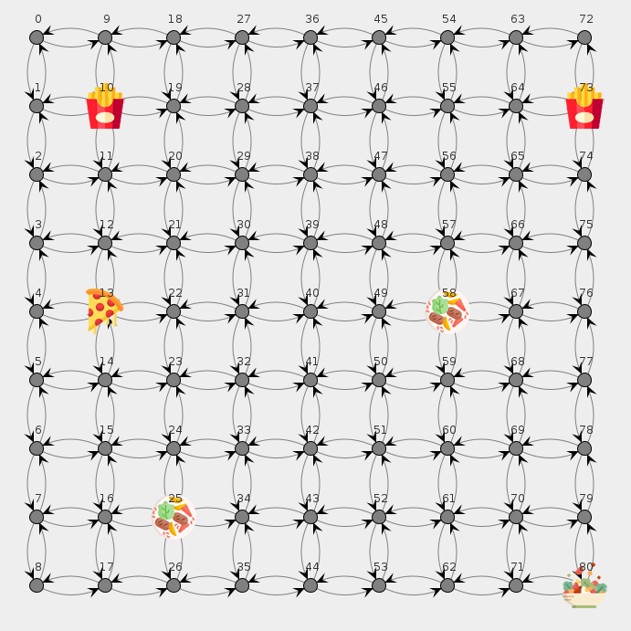  |  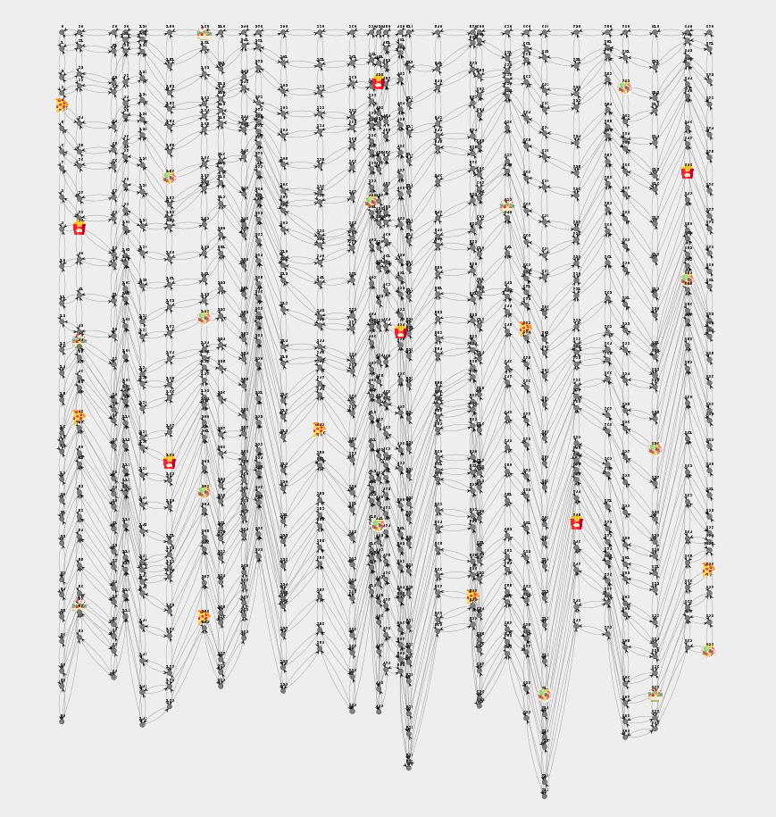
:-------------------------:|:-------------------------:
Grafo $8 \times 8$ | Grafo $30 \times 30$

Todos os grafos presentes na aplicação têm as localizações dos seus restaurantes definidas inicialmente e os seus vértices, na API de visualização, distinguidos com diferentes ícones, para os diferentes tipos de restaurante. Para o grafo $8 \times 8$, por exemplo, a lista de restaurantes existentes é:
```cpp
Type: Fast Food         Vertex id: 10
Type: Pizzeria          Vertex id: 13
Type: Restaurant        Vertex id: 25
Type: Restaurant        Vertex id: 58
Type: Fast Food         Vertex id: 73
Type: Vegetarian        Vertex id: 80
```

A conectividade dos grafos usados é analisada seguidamente, durante a Fase III de implementação, onde foram criados grafos reduzidos a partir destes em grelha, representando mapas para outros meios de transporte, mais restritivos.

## 5.3 Algoritmos efetivamente implementados

Dadas as limitações temporais e logísticas deste projeto, chegado o momento de eleger algoritmos de cálculo de distâncias e caminhos entre vértices, por questões mais relacionadas com uma análise interpretativa de resultados distintos, decidimos focar-nos em dois algoritmos apenas.

Cada um representa uma generalização de um subproblema do caminho mais curto, o **Dijkstra unidirecional** como algoritmo representativo do problema *Single Source Multiple Destinations*, que, com a utilização de uma *fila de prioridade*, apresenta uma complexidade temporal de $O( (V+E)\log V)$ e espacial de $O(V)$

```cpp

1  function Dijkstra(Graph, source):
2      dist[source] ← 0                           // Initialization
3
4      create vertex priority queue Q
5
6      for each vertex v in Graph:           
7          if v ≠ source
8              dist[v] ← INFINITY                 // Unknown distance from source to v
9              prev[v] ← UNDEFINED                // Predecessor of v
10
11         Q.add_with_priority(v, dist[v])
12
13
14     while Q is not empty:                      // The main loop
15         u ← Q.extract_min()                    // Remove and return best vertex
16         for each neighbor v of u:              // only v that are still in Q
17             alt ← dist[u] + length(u, v) 
18             if alt < dist[v]
19                 dist[v] ← alt
20                 prev[v] ← u
21                 Q.decrease_priority(v, alt)
22
23     return dist, prev
```

e o **Floyd-Warshall** como algoritmo abrangendo a questão *Multiple Sources Multiple Destinations*, com complexidade temporal na ordem de $O(V³)$ e espacial na ordem de $O(V²)$. 

```cpp
1 let dist be a |V| × |V| array of minimum distances initialized to ∞ (infinity)
2 function FloydWarshall():
3    for each edge (u, v) do
4      dist[u][v] ← w(u, v)  // The weight of the edge (u, v)
5    for each vertex v do
6         dist[v][v] ← 0
7    for k from 1 to |V|
8         for i from 1 to |V|
9             for j from 1 to |V|
10                 if dist[i][j] > dist[i][k] + dist[k][j] 
11                     dist[i][j] ← dist[i][k] + dist[k][j]
12                 end if
```

Como alicerce para a aplicação final, dada a análise exaustiva a todas as fases de implementação, o algoritmo **Floyd-Warshall** foi o escolhido para vigorar e funcionar em pleno.

Enuncia-se, também, a implementação do algoritmo de **Pesquisa em Profundidade (DFS)**, na sua versão recursiva, para a análise da conectividade dos grafos, com uma complexidade temporal de $O(V+E)$ e espacial de $O(V)$:

```cpp
1 function DFS-recursive(G, s):
2       mark s as visited
3       for all neighbours w of s in Graph G:
4           if w is not visited:
5               DFS-recursive(G, w)
```

## 5.4 Análise empírica

Para uma análise generalizada e abrangente dos algoritmos tidos em consideração, estes foram testados em todos os grafos grid elegíveis e à nossa disposição. Os testes foram efetuados em conformidade com as fases de elaboração determinadas anteriormente e a sua eficiência temporal foi avaliada.

### 5.4.1 Fase I

Na Fase I de implementação, considerado o caso atómico de um estafeta que entrega apenas um pedido, entre um restaurante e a morada de um cliente, realizando todas as tarefas em sequência, foi calculada a média do tempo demorado na realização de 1 a 100 pedidos, para os algoritmos mais genéricos, neste caso, o **Dijkstra unidirecional** e o **Floyd-Warshall**. Os tempos foram medidos em micro-segundos e os grafos considerados tinham dimensões variando entre $4 \times 4$ e $30 \times 30$, como relatam os seguintes dados:


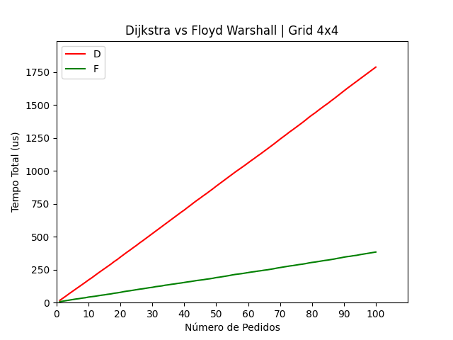  |  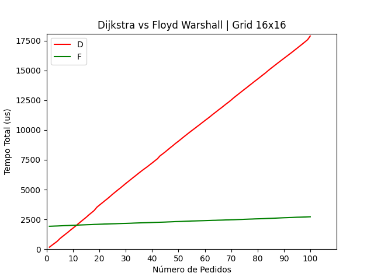
:-------------------------:|:-------------------------:
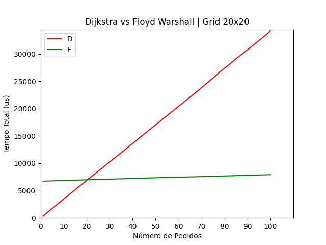  |  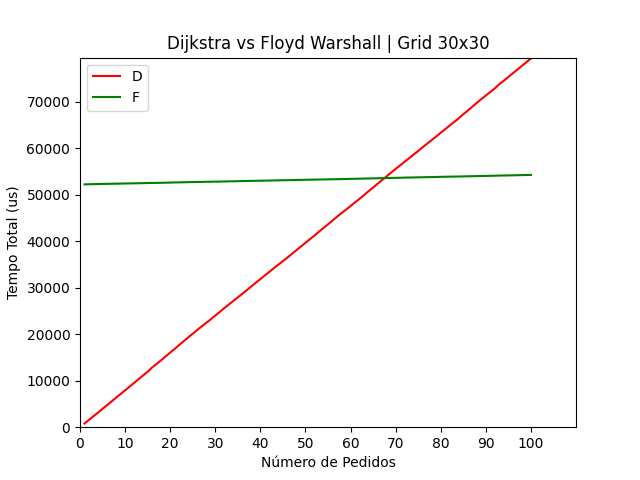

Um olhar mais atento aos dados do grafo de dimensões $20 \times 20$, por exemplo, revela um pormenor interessante relativamente à concorrência entre estes dois algoritmos e à sua rentabilidade, para uso na aplicação. A explicação para os valores reside no facto de o algoritmo de **Floyd-Warshall** demorar ligeiramente mais tempo, inicialmente, devido ao pré-processamento necessário, mantendo, de seguida, um tempo médio de execução de cada pedido muito inferior, sendo logo ultrapassado, em matéria de tempo acumulado total, pelo algoritmo de **Dijkstra**, com um comportamento linear mais acentuado.

A partir de um certo número de pedidos, o algoritmo de **Floyd-Warshall** torna-se o mais viável, o que satisfaz as necessidades, a longo prazo, de uma aplicação deste tipo, tanto em grafos grandes, como em grafos mais pequenos, já que o custo de operação do algoritmo de **Dijkstra** aumenta consideravelmente.

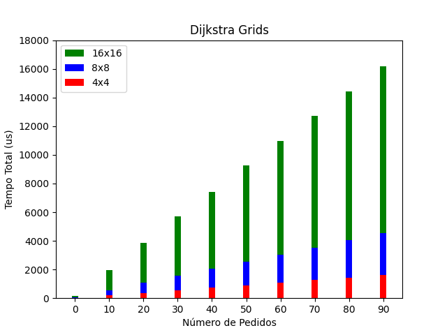  |  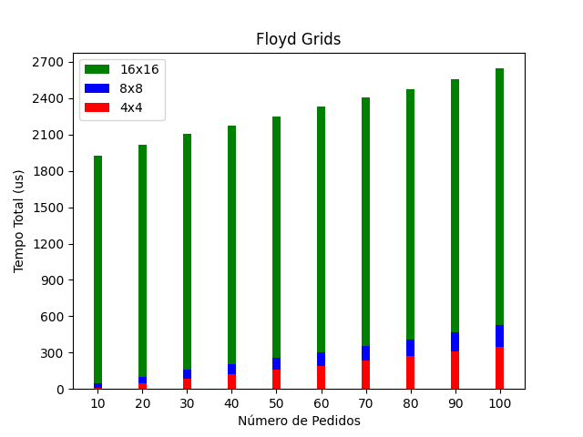
:-------------------------:|:-------------------------:

Os valores mais precisos, em micro-segundos, para alguns destes gráficos, encontram-se na tabela seguinte:

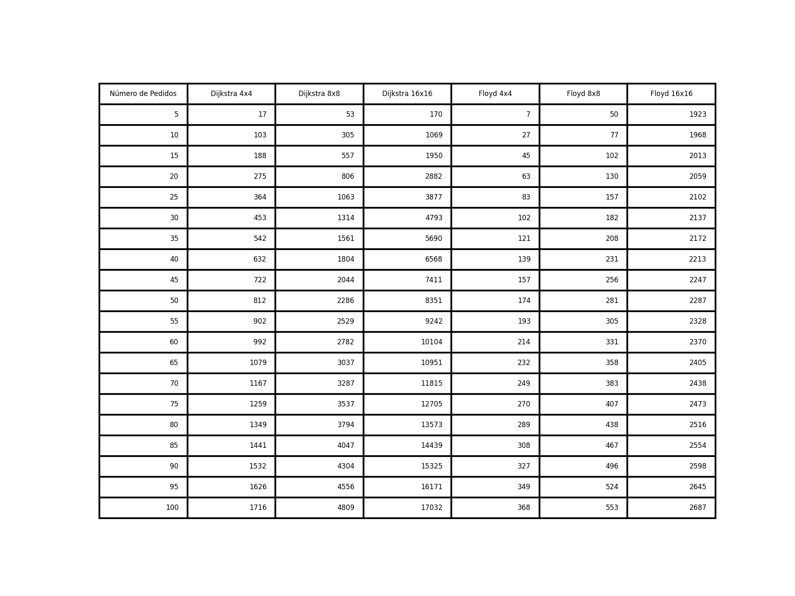

O tempo médio gasto a cada pedido, para o algoritmo de **Dijkstra**, revelou, assim, o esperado e aproximado tempo computacional de proporções $O((E + V) \log V )$. O pré-processamento realizado pelo algoritmo de **Floyd-Warshall**, contabilizado apenas como parte do primeiro pedido, revelou a sua complexidade na ordem $O(V³)$ e um tempo de execução mínimo para a reconstrução dos caminhos, na ordem $O(E)$, com $E$ somente o número de arestas entre os dois vértices em consideração.

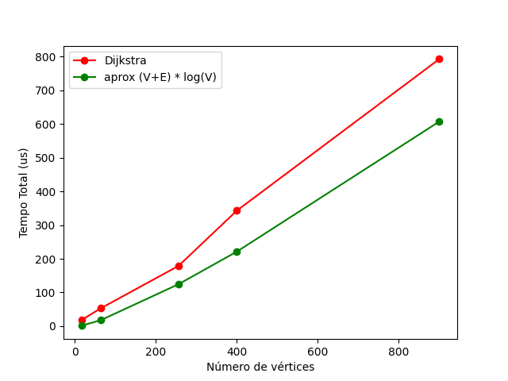 | 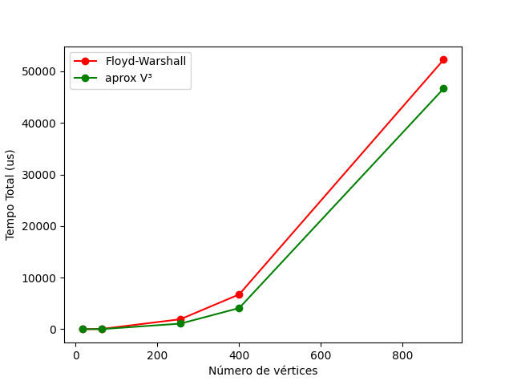
:---|---:

Com isto, confirmamos também a complexidade temporal destes algoritmos e reafirmamos e fundamentamos as escolhas para as fases seguintes.

### 5.4.2 Fase II

Nesta segunda fase, voltámos a analisar a execução dos algoritmos, desta vez, tendo em conta a existência de vários estafetas e a distribuição de vários pedidos pelos funcionários disponíveis e elegíveis para os entregar. É de notar que a escolha do estafeta encarregue de determinado pedido era diretamente influenciada pela sua proximidade ao restaurante, o que implicava ainda mais cálculos intermédios e mais execuções dos algoritmos usados. Foram gerados, portanto, pedidos e a cada tarefa concluída, os estafetas atualizavam a sua posição. 

```cpp
    // Add Employees
    vector<Employee> employees;
    Employee employee1(0,Coordinates(10),1000,CAR,true);
    employees.push_back(employee1);
    Employee employee2(1,Coordinates(20),1000,CAR,true);
    employees.push_back(employee2);
    Employee employee3(2,Coordinates(30),1000,CAR,true);
    employees.push_back(employee3);

    // Add Requests
    vector<Request> requests = getRandomRequests(graph,2000);
    queue<Request> requestsQueue;
    for(Request request : requests){
        requestsQueue.push(request);
    }

    // ... Same logic for the Floyd Algorithm

    while(!requestsQueue.empty()){
        vector<SingleTask*> tasks = distributeRequestsByCloseness_Dijkstra(graph, requestsQueue, employees);

        // Couldn't find any Employees to fulfill the remaining requests
        if(tasks.empty())
            return 0;

        // Get requests distribution and paths
        for(int i = 0; i < tasks.size(); i++){
            tasks[i]->setDijkstraPath(graph);
        }
    }
```

Para efeitos de teste desta fase de implementação, considerou-se a existência de 3 estafetas, distribuídos aleatoriamente por um grafo, representativo de uma área urbana, de dimensões $16 \times 16$, e geraram-se até 2000 pedidos também aleatórios.

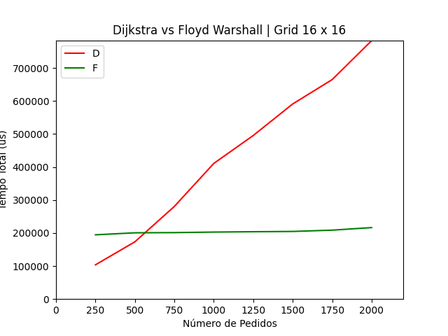

### 5.4.3 Fase III

Aqui, variados meios de transporte começaram já a ser considerados, o que correspondeu à necessidade de criar mapas adaptados, partindo dos já existentes. A solução, em conformidade com as simulações efetuadas, foi reconverter os mapas em grelha para grafos com um número inferior de vértices e arestas disponíveis, simulando a transitabilidade de certas vias e a sua acessibilidade, conforme o meio de transporte. Um exemplo de um grafo adaptado para servir estafetas que se desloquem a pé, ou de bicicleta, é o seguinte:

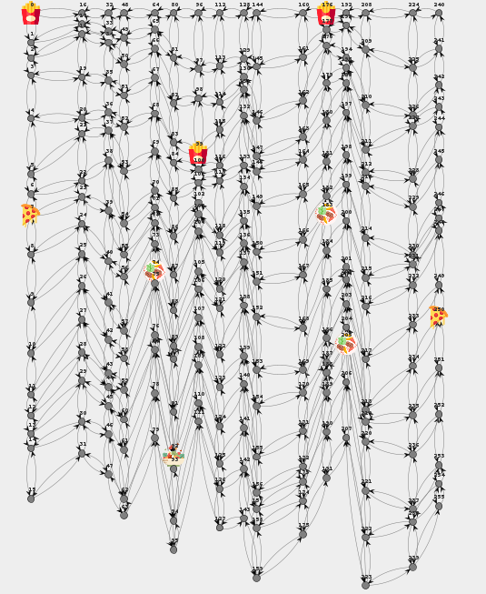  |  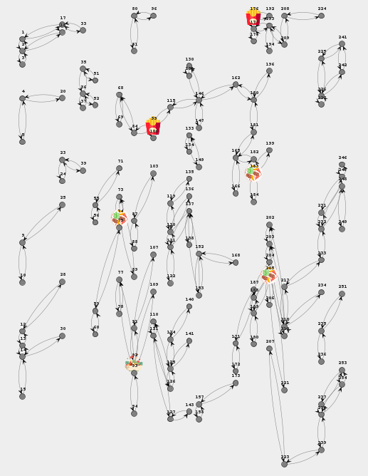
:-------------------------:|:-------------------------:
Grafo original para veículos motorizados | Grafo reduzido para estafetas a pé ou de bicicleta

Neste ponto, tornou-se pertinente a análise paralela à conetividade dos grafos, sobretudo dos grafos maiores e dos respetivos grafos reduzidos, que revelaram pormenores também visíveis nas imagens anteriores. Obteve-se, assim, a média e o máximo do número de vértices descobertos, partindo de um dado vértice, através do algoritmo de **Pesquisa em Profundidade (DFS)**:

Grafo | Número de Vértices | Média de Vértices Encontrados | Máximo de Vértices Encontrados
---|---|---|---
16x16|256|256|256
16x16 reduzido|142|9|20
20x20|400|400|400 
20x20 reduzido|206|10|17
30x30|900|900|900
30x30 reduzido|498|10|26

Desta tabela, retira-se, apenas, a informação da super conectividade dos grafos originais, que contrasta com a mais fraca conectividade dos grafos adaptados/reduzidos, usados para entregas a pé, ou de bicicleta.

### 5.4.4 Fase IV

Chegada esta fase, decidiu-se a sua não inclusão prática na aplicação, pelo seu desajuste em relação à situação real, sendo apenas representativa de algo hipotético. A sua implementação resumir-se-ia a duas estratégias, após a deteção de um obstáculo na via - aresta inacessível: 
* pré-processar, de novo os grafos envolvidos, com o algoritmo de Floyd-Warshall; 
* ou optar, nestas situações específicas, por usar o algoritmo de Dijkstra. 

Ambas teriam as vantagens e desvantagens já enunciadas e a sua demonstração não traria mais valor ao que já foi simulado.