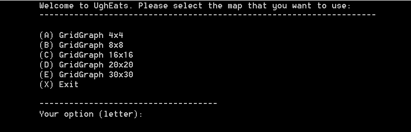
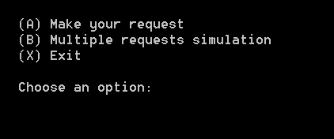
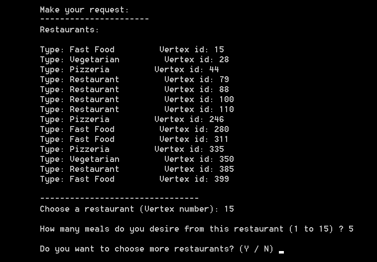
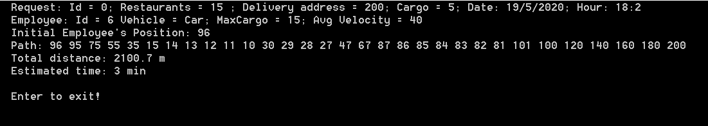
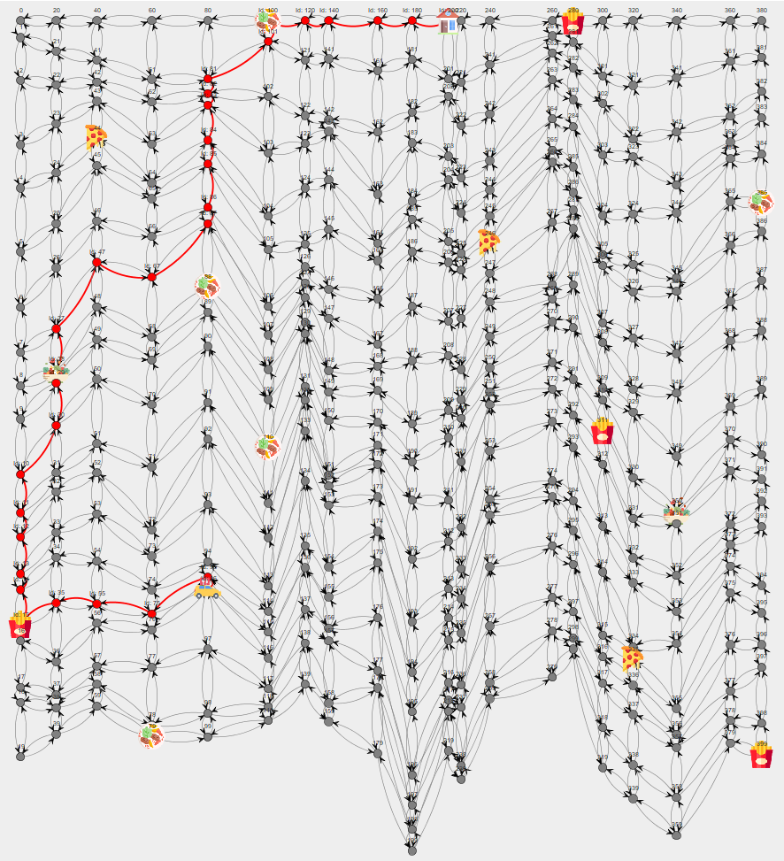
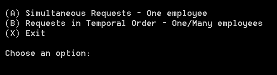
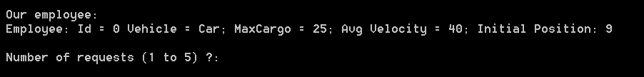
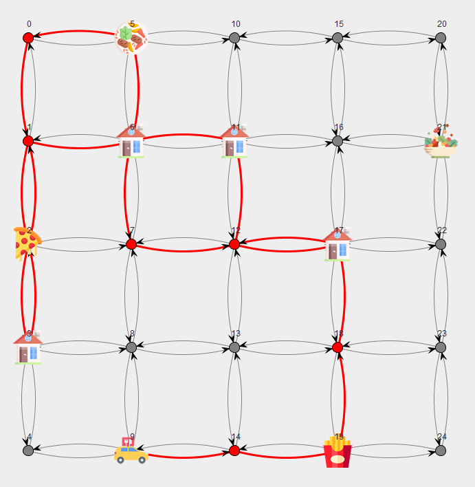
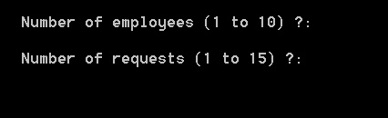
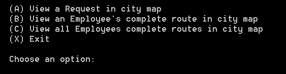

# 7. Principais casos de uso implementados

Depois de todos os algoritmos estarem implementados e estudadas todas as questões relacionadas com a análise temporal e espacial, passamos para o desenvolvimento da solução para o contexto do projeto.

A aplicação desenvolvida, poderá ser utilizada em vários mapas (4x4, 8x8, 16x16, 20x20, 30x30 e Penafiel), cabendo ao utilizador escolher o mapa que deseja quando a aplicação se inicia.

 

Escolhido o mapa, é perguntado ao utilizador se pretende fazer apenas um pedido ou simular múltiplos pedidos.

||
|:-------------------------:|
|Escolha do tipo de pedido|

De seguida, irá ser perguntado ao utilizador se deseja visualizar o mapa escolhido, onde será possível visualizar a localização dos vários restaurantes.

Seguidamente, no caso de grafos maiores, será mostrada uma mensagem ao utilizador durante alguns segundos, indicando que o mapa escolhido está a ser processado. É de notar que, no caso do grafo da cidade de Penafiel, o processamento já foi previamente realizado (com o algoritmo de Floyd Warshall), sendo este tempo de espera provocado pela leitura das matrizes de distâncias e de predecessor no caminho mais curto dos respetivos ficheiros. Em todos os outros casos o processamento é realmente feito no momento, recorrendo ao mesmo algoritmo.

## 7.1 Realização de um pedido

Quando a opção escolhida é fazer apenas um pedido, é possível fazer um pedido que pode conter apenas um restaurante entre os apresentados na lista ou então vários, sendo que para cada restaurante se escolhe quantas refeições se deseja deste, estando o tamanho total do pedido limitado a 15 refeições.

||
|:-------------------------:|
|Menu de escolha dos restaurantes para o grafo 20x20|

Depois de o pedido estar completo, serão apresentadas na aplicação as informações sobre o pedido, sobre o estafeta que o vai entregar, o caminho percorrido pelo estafeta desde a sua localização inicial até ao local de entrega, a distância total percorrida e o tempo estimado de espera. É ainda apresentado o grafo com o caminho percorrido pelo estafeta.

||
|:-------------------------:|
|Informações sobre o pedido e respetiva entrega|

||
|:-------------------------:|
|Caminho percorrido pelo estafeta|

*Para a implementação deste caso de utilização são usados os algoritmos **1** e **2**, sendo o segundo usado se forem definidos múltiplos restaurantes e o primeiro quando é escolhido apenas um.*


## 7.2 Simulação de múltiplos pedidos

No caso de a opção escolhida ser a de simular vários pedidos, existem 2 opções.

||
|:-------------------------:|
|Opções de simulação de pedidos|

### 7.2.1 Um estafeta - Vários pedidos no mesmo deslocamento (variante do TSP)

Caso o utilizador opte pela **opção A**, será apresentado ao utilizador o estafeta disponível para entregar os pedidos simultâneos e será pedido ao utilizador quantos pedidos quer simular.

||
|:-------------------------:|
|Introdução dos dados para simulação de pedidos simultâneos|

Depois de escolhidos, irão aparecer as informações de cada um dos pedidos simulados, bem como sobre a sua entrega, tal como foi descrito anteriormente.

É também mostrado ao utilizador o grafo com o caminho percorrido pelo estafeta para entregar os pedidos.

||
|:-------------------------:|
|Caminho percorrido pelo estafeta|

*Para a implementação deste caso de utilização é usado o algoritmo **3**.*


### 7.2.2 Múltiplos estafetas - distribuição de pedidos por ordem temporal

Se o utilizador preferir a **opção B**, a seguir terá de escolher um número de estafetas, entre 1 e 10, e o número de pedidos a simular.

```cpp
int maxRequests = 15;
do{
        cout << "\t Number of employees (1 to 10) ?: ";
        cin >> employeesNum;
        cin.ignore(1000, '\n');
        cout << endl;
        if(employeesNum > 10 || employeesNum < 1) cout << "Try again!" << endl;
} while(employeesNum > 10 || employeesNum < 1);
```

||
|:-------------------------:|
|Introdução dos dados para simulação de pedidos|

De seguida, são apresentadas as informações sobre os pedidos gerados e sobre os estafetas criados, assim como as informações sobre a entrega de cada um dos pedidos, tal como acima foi descrito.

No final da lista, aparece um menu onde podemos escolher entre algumas possíveis visualizações dos grafos:

||
|:-------------------------:|
|Opções de visualização dos grafos|

**Opção A -** Visualizar o caminho percorrido para realizar um dado pedido;

**Opção B -** Visualizar o percurso total efetuado por um determinado estafeta;

**Opção C -** Visualizar os percursos efetuados por todos os estafetas.

*Para a implementação deste caso de utilização é usado o algoritmo **1**.*